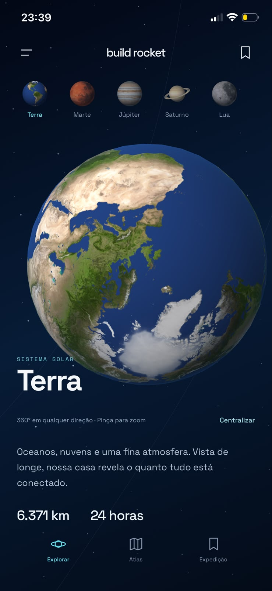
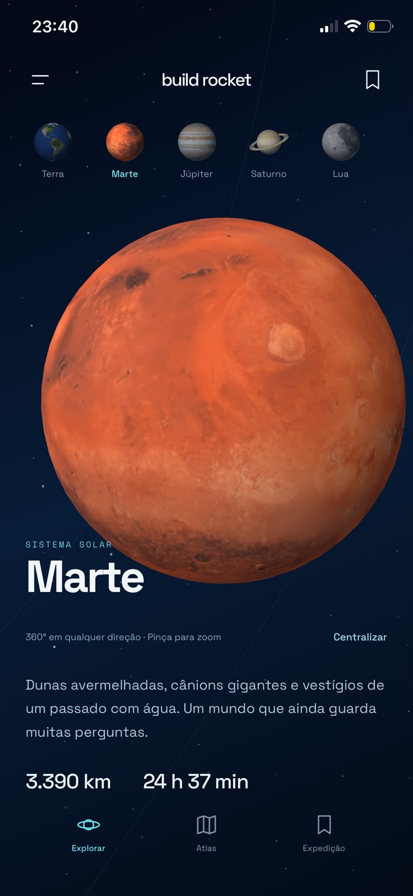
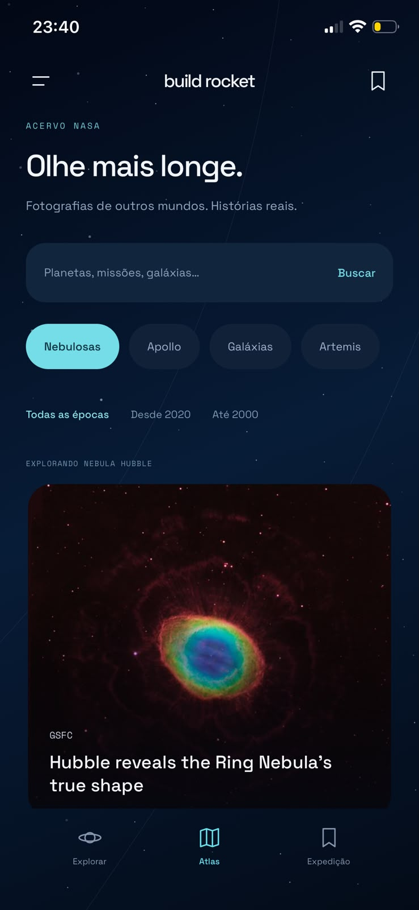
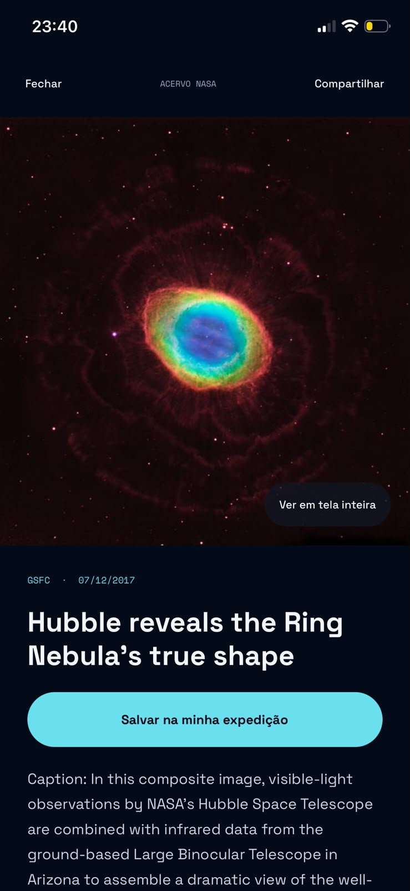
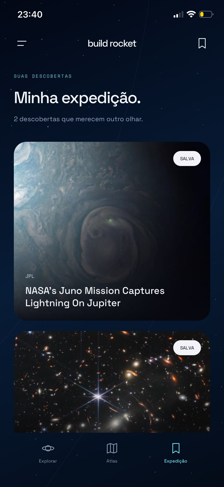

# Build Rocket

Aplicativo de exploração espacial para iOS e Android, desenvolvido com **React Native, Expo e TypeScript**. Planetas em 3D, imagens do acervo NASA e uma coleção pessoal de descobertas em uma interface contínua inspirada no espaço.

## Veja o aplicativo

Capturas reais do aplicativo no iPhone, fornecidas por Giselly Pereira. As imagens foram preservadas, sem alteração do conteúdo das telas.

<table>
  <tr>
    <td align="center"><br /><strong>Terra em 3D</strong></td>
    <td align="center"><br /><strong>Marte em 3D</strong></td>
    <td align="center"><br /><strong>Atlas NASA</strong></td>
  </tr>
</table>
<table>
  <tr>
    <td align="center"><br /><strong>Observatório</strong></td>
    <td align="center"><br /><strong>Minha expedição</strong></td>
  </tr>
</table>

## O que você pode explorar

- **Cinco destinos:** Terra, Marte, Júpiter, Saturno e Lua, com mapas de superfície locais, iluminação e rotação automática suave.
- **Interação 3D:** rotação livre de 360° nos dois eixos, zoom por pinça e centralização do enquadramento. A rotação automática pausa durante o toque e pode ser interrompida pelo controle da interface.
- **Além do globo:** coleções por destino com imagens, descrições, datas, créditos e registros relacionados — como rovers em Marte, Apollo na Lua e Cassini em Saturno.
- **Atlas NASA:** pesquisa, paginação, atalhos por assunto e filtros por época.
- **Observatório:** detalhes das imagens, palavras-chave, compartilhamento, link para a fonte e visualização ampliada com uma versão maior quando disponível.
- **Minha expedição:** descobertas salvas no aparelho com AsyncStorage, sem cadastro.
- **Movimento reduzido:** respeito à preferência do sistema e controle manual na interface.

## Tecnologias

| Camada | Tecnologias |
| --- | --- |
| Aplicativo | React Native 0.86 · Expo SDK 57 · React 19 · TypeScript |
| Cena 3D | Three.js · React Three Fiber · Expo GL |
| Dados e API | NASA Image and Video Library · TanStack Query |
| Persistência | AsyncStorage |
| Imagens e interação | Expo Image · Expo Haptics · Animated · PanResponder |
| Interface | React Native SVG · Space Grotesk · Space Mono |
| Verificação | Node Test Runner · tsx · TypeScript · Prettier |

## Executar localmente

Requisitos: Node.js compatível com o Expo SDK 57, npm e um aparelho com Expo Go compatível, ou um development build. Para avaliar o fluxo 3D, use um aparelho iOS ou Android com suporte a Expo GL.

```bash
git clone https://github.com/GisellyPereira/build-rocket.git
cd build-rocket
npm ci
npm start -- --clear
```

Abra o QR code no aparelho. Se o Expo Go não suportar o SDK do projeto, utilize uma versão compatível ou um development build.

## Verificar o código

```bash
npm run typecheck
npm test
npm run format:check
```

A suíte possui **27 testes** para dados da NASA, filtros, seleção de versões de imagens, favoritos, armazenamento, gestos 3D, inicialização do Three e adaptação do Expo GL e compatibilidade do relógio baseado em Timer. Os testes e a verificação de tipos não substituem a avaliação de desempenho em aparelhos reais.

## Arquitetura

```text
App.tsx                    Navegação e composição das telas
src/components/            Cena 3D, acervo, detalhes e componentes visuais
src/data/                  Destinos e informações educativas
src/hooks/                 Persistência da expedição
src/lib/                   API, normalização, gestos e adaptação do Expo GL
tests/                     Testes de comportamento e integração
docs/screenshots/          Capturas reais do aplicativo
assets/planets/             Mapas locais e prévias esféricas
```

A cena desenha sob demanda e pausa quando fica fora da tela, em segundo plano ou atrás de um modal. Gestos atualizam referências em vez de renderizar React a cada movimento; as texturas substituídas são liberadas. Consultas têm cache, cancelamento, timeout e tratamento de falhas, e as listas do acervo são virtualizadas.

As decisões técnicas, os avisos conhecidos do renderizador e o roteiro de avaliação em aparelhos estão em [Engenharia e verificação](docs/ENGINEERING.md).

## API, conteúdo e créditos

O Build Rocket consome a **API pública e gratuita disponibilizada pela NASA**, a [NASA Image and Video Library](https://images.nasa.gov/). A integração utilizada não exige cadastro nem chave de API e permite explorar fotografias reais de planetas, galáxias, nebulosas e missões espaciais.

Por meio dessa API, o aplicativo oferece busca por assunto, paginação e filtros por ano, além de apresentar títulos, descrições, datas, palavras-chave e créditos fornecidos pelo acervo. Também consulta as versões disponíveis das imagens para exibir fotografias ampliadas no Observatório.

A integração utiliza os endpoints `GET /search` e `GET /asset/{nasa_id}`, na base `https://images-api.nasa.gov`. As consultas têm cache, cancelamento, timeout e tratamento de falhas. As descrições e palavras-chave permanecem no idioma original do acervo. Consulte a [documentação oficial da API](https://images.nasa.gov/docs/images.nasa.gov_api_docs.pdf).

Os modelos 3D, mapas de superfície e informações educativas dos destinos são recursos locais do projeto; o acervo fotográfico é consultado pela API.

Os mapas planetários são de **Solar System Scope / INOVE**, sob **CC BY 4.0**. Os JPGs originais foram preservados; as prévias PNG são projeções esféricas com iluminação simulada. Consulte a [atribuição dos mapas](assets/planets/CREDITS.md).

As imagens do acervo mantêm os créditos fornecidos pela NASA e o link para o registro original. Alguns materiais podem incluir direitos de terceiros; consulte os créditos antes de reutilizá-los. Build Rocket é um projeto independente, sem vínculo oficial com a NASA. Os modelos e dados dos planetas têm finalidade educativa, sem escala ou garantia de precisão cartográfica.

## Autoria

Desenvolvido por [Giselly Pereira](https://github.com/GisellyPereira).
